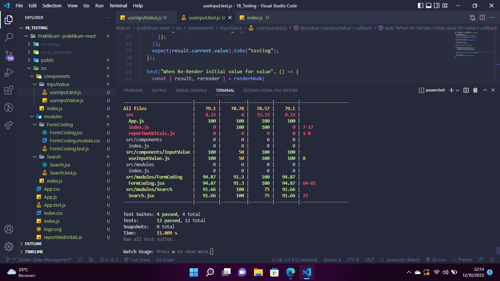

# Testing

### Resume Testing

### 1. Basic Testing

> **Testing** merupakan proses **memverifikasi** bahwa teset assertions kita benar dan bahwa code yang kita buat tetap benar sepanjang aplikasi. **Test assertion** ini adalah ekspresi `boolean` yang mengembalikan nilai `true` kecuali ada bug di kode kita

- #### Manfaat dari Testing?

1. Ketika memiliki code yang tercover oleh testing, kita lebih percaya diri untuk merubah suatu bagian pada code

2. Mengurangi Bug pada aplikasi dengan mencegah terjadinya beberapa bug

- #### Kategori Testing

1. **Rendering Component Trees** di dalam environment tes yang sudah disederhanakan dan ditegaskan pada keluarannya. Kita akan fokus pada bagian ini.
2. **Menjalankan Aplikasi Lengkap** di dalam browser asli (end-to end)

- #### Pertimbangan Memilih Tools

1. Kecepatan Iterasi vs Environment yang realistis
2. Seberapa Banyak Mock

- #### Rekomendasi Tools

1. Jest
2. React Testing Library

### 2. Create Basic Testing With RTL (React Testing Library)

1. Rendering Component

Fungsi `render()` RTL akan merender file `.jsx` apapun yang dibutuhkan, setelah itu baru bisa memiliki akses ke komponen React

```js
import React from "react";
import { render, screen } from "@testng-library/react";

import App from "./App";

describe("App", () => {
  test("renders App Component", () => {
    render(<App />);

    screen.debug();
  });
});
```

2. Memilih Element

RTL menawarkan berbagai fungsi untuk mendapatkan element contohnya dengan `getByText` untuk mengakses dari element yang sudah dipilih

```js
import React from "react";
import { render, screen } from "@testng-library/react";

import App from "./App";

describe("App", () => {
  test("renders App Component", () => {
    render(<App />);

    screen.getByText("Search");

    expect(screen.getByText("Search")).toBeIntTheDocument();
  });
});
```

### 3. Testing Custom Hooks

Saat menggunakan Testing Custom Hook, kita harus menggunakan library tambahan dengan. Cara install sebagai berikut :
`npm install --save-dev @testing-library/react-hooks`

**Example!**

```jsx
//main files

import { useState, useEffect } from "react";
export function useUpperCase(initialValue) {
  const transformed = initialValue.toUpperCase();
  const [value, setValue] = useState(transformed);

  const update = (newValue) => {
    setValue(newValue.toUpperCase());
  };

  useEffect(() => {
    setValue(initialValue.toUpperCase());
  }, [initialValue]);

  return { value, update };
}
```

```js
//test.js

import { renderHook } from "@testing-library/react-hooks";
import { useUpperCase } from "./useUpperCase";

describe("when rendered", () => {
  it("returns current initial value, uppercased", () => {
    const { result } = renderHook(() => useUpperCase("test string"));

    expect(result.current.value).toEqual("TEST STRING");
  });
});
```


